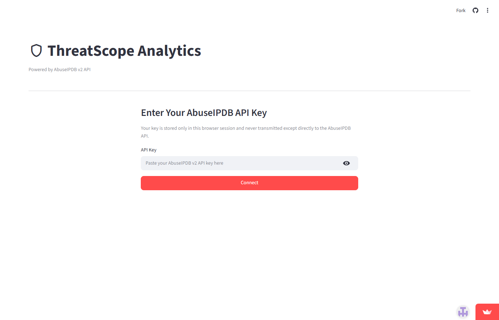

# ThreatScope Analytics

A real-time security dashboard that lets you investigate malicious IP addresses and monitor the global threat landscape — powered by the [AbuseIPDB](https://www.abuseipdb.com/) v2 API.



**Live app:** [ipthreatscope.streamlit.app](https://ipthreatscope.streamlit.app/)

---

## What problem does this solve?

Security engineers, sysadmins, and threat analysts often need to answer a simple question fast: *is this IP address a known threat?* Doing that one at a time through the AbuseIPDB website is tedious. Parsing raw JSON from the API is even worse. ThreatScope gives you a clean browser-based interface that handles the API calls, visualizes the data, and makes sure nothing gets thrown away — every field the API returns is accessible somewhere on screen.

Beyond single-IP lookups, ThreatScope also surfaces the global blacklist: a live feed of the most abusive IPs on the internet right now, sorted by confidence score, with a freshness timestamp so you always know how stale the data is.

---

## Features

### Global Blacklist Feed
- Pulls the current AbuseIPDB blacklist (IPs with ≥ 75 confidence score) and displays it as a sortable table ordered by abuse score and recency
- Shows when the blacklist was generated so you know exactly how fresh the data is
- Cached server-side for 4 hours to protect the daily API quota (only 5 blacklist requests allowed per day on the free plan)
- Manual refresh button that respects the rate limit — if you've hit the daily cap, it disables itself and shows the cached data instead of throwing an error
- Score distribution chart breaking down the blacklist into score bands

### IP Analysis
**Single IP check** — enter any IPv4 or IPv6 address and get back:
- Abuse confidence score shown as a colour-coded gauge (green / amber / red)
- Country of origin with flag
- Network usage type (data centre, ISP, CDN, etc.) highlighted by category
- Report activity timeline showing when abuse was reported over the last 90 days
- Every other field the API returns (ISP, domain, hostnames, Tor exit node status, whitelisting status, full report list with comments) in an expandable Raw Intelligence section

**Bulk CSV reporting** — upload a CSV of IPs to report multiple addresses to AbuseIPDB in one go. A template CSV is available to download so you get the column format right first time.

**JSON file review** — upload a saved AbuseIPDB JSON response (either a `/check` or `/blacklist` response) and the app will detect the type automatically and render the full visualisation without making any live API call. Useful for reviewing saved responses offline or sharing findings with a colleague.

---

## Getting started

### 1. Get a free API key

Go to [abuseipdb.com](https://www.abuseipdb.com/), create a free account, and copy your API key from the account dashboard. The free tier gives you 1,000 check requests per day and 5 blacklist requests per day — more than enough for day-to-day use.

### 2. Open the app

Visit [ipthreatscope.streamlit.app](https://ipthreatscope.streamlit.app/), paste your API key into the field, and click **Connect**. Your key is stored only in your browser session and is sent exclusively to the AbuseIPDB API — it never touches any other server.

---

## Run locally

Requires [uv](https://docs.astral.sh/uv/).

```bash
git clone https://github.com/researchsite/ThreatScope.git
cd ThreatScope
uv sync
uv run streamlit run app/main.py
```

Then open `http://localhost:8501` in your browser.

---

## Project layout

```
app/
├── main.py              # Entry point and auth gate
├── api/
│   ├── client.py        # HTTP wrapper (headers, rate limit handling, URL encoding)
│   └── models.py        # Dataclasses and parsers for API responses
├── tabs/
│   ├── blacklist.py     # Global Blacklist Feed tab
│   └── ip_analysis.py   # IP Analysis tab
└── components/
    ├── gauge.py         # Plotly abuse confidence gauge
    └── tables.py        # Shared table helpers and category decoder
```

---

## API coverage

| Endpoint | Used for |
|---|---|
| `GET /api/v2/blacklist` | Global Blacklist Feed tab |
| `GET /api/v2/check` | Single IP analysis |
| `POST /api/v2/bulk-report` | Bulk CSV reporting |
