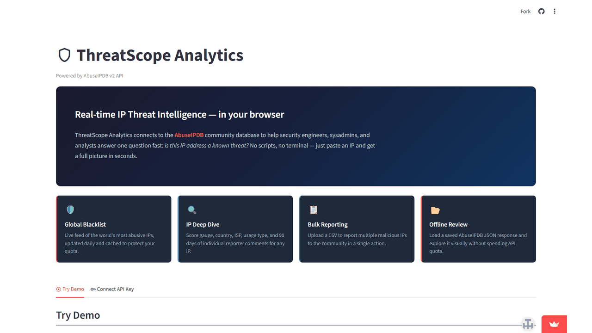
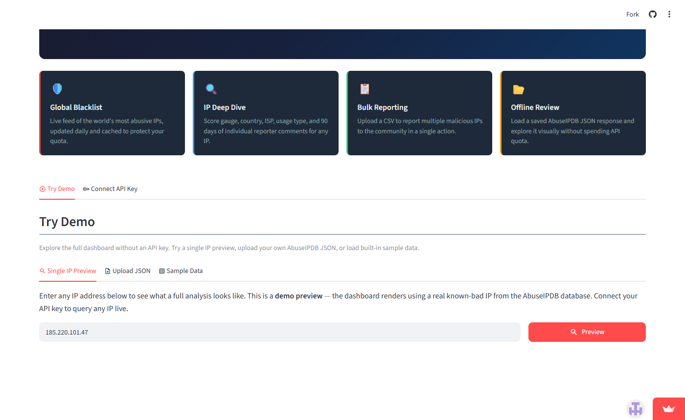
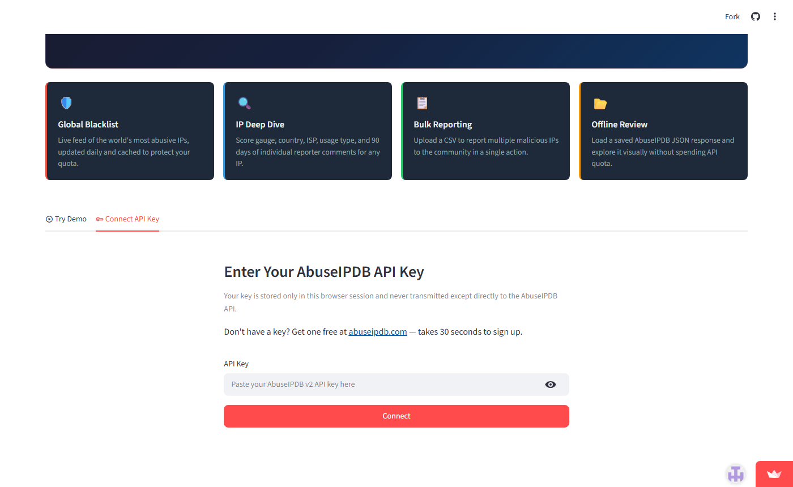
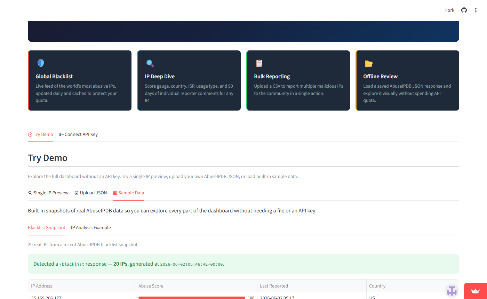
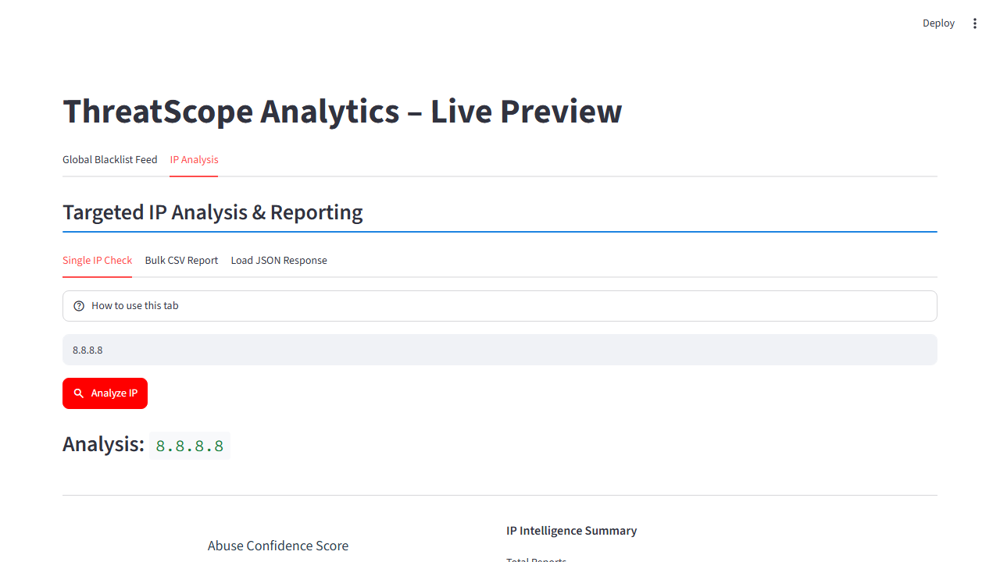
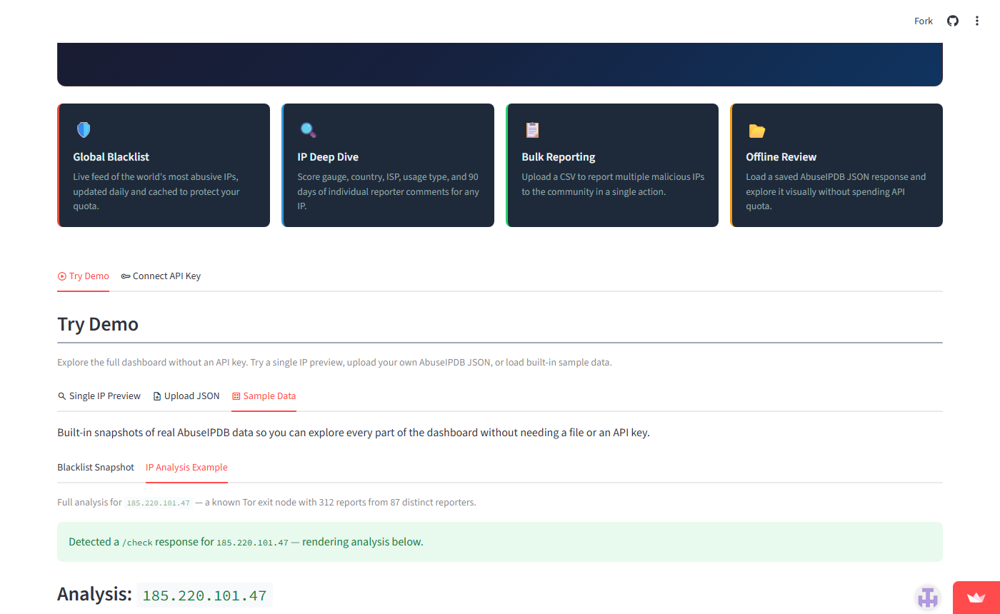
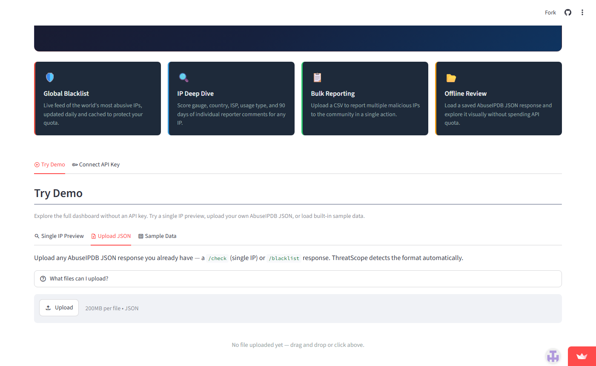

# ThreatScope Analytics

A browser-based security dashboard for investigating malicious IP addresses and monitoring the global threat landscape — powered by the [AbuseIPDB](https://www.abuseipdb.com/) v2 API.

**Live app:** [ipthreatscope.streamlit.app](https://ipthreatscope.streamlit.app/)



---

## Who is this for?

**SOC and threat intelligence teams** — when an alert fires and you need context on an IP fast, ThreatScope surfaces confidence scores, country, ISP, usage type, and 90 days of reporter comments without writing a single API call. It handles caching, rate limits, and bulk operations so analysts can focus on the actual investigation.

**Startups and small security teams** — if you're building out your security posture and don't yet have a full SIEM, this gives you a usable threat intelligence interface on day one. It's free to run, open source, and connects to a community-sourced database that improves with every report.

The goal is practical and honest: it's a lightweight tool that does one thing well. Not a replacement for enterprise platforms, but a solid starting point.

---

## Try it without an API key

Open the app and click **Try Demo** — no account needed. You can type any IP address and see what a full analysis looks like, browse a real blacklist snapshot, or upload any AbuseIPDB JSON file you already have.



The demo uses a bundled snapshot of real AbuseIPDB data, so everything you see is accurate — just not a live query.

---

## Connect your API key

Get a free key at [abuseipdb.com](https://www.abuseipdb.com/) (takes 30 seconds). Click **Connect API Key**, paste it in, and the full dashboard opens.



Your key is stored only in the browser session. It goes directly to the AbuseIPDB API — nothing else touches it.

---

## Global Blacklist Feed

A live feed of the most reported IPs on the internet, sorted by abuse confidence score. The table shows the top offenders with score, last report time, and country. Expand **View Full Blacklist Data** for every field the API returns.



The feed is cached for 4 hours to protect the free-tier daily quota (5 blacklist requests per day). The refresh button disables automatically if the limit is hit and falls back to cached data gracefully.

---

## IP Analysis

Enter any IPv4 or IPv6 address for a full intelligence breakdown.


**What you get:**
- Abuse confidence score as a colour-coded gauge (green → amber → red)
- Country flag, ISP, domain, and usage type
- Whether it's a Tor exit node or whitelisted
- Report activity timeline over the last 90 days
- Full raw intelligence expander with every API field including individual reporter comments



---

## Sample data — IP analysis example

The demo includes a full walkthrough of a known Tor exit node (`185.220.101.47`, 312 reports from 87 distinct reporters) so you can explore every part of the UI without spending API quota.



---

## Bulk CSV reporting

Upload a CSV to report multiple IPs to the AbuseIPDB community in one action. Download the template to get the column format right, preview your data before submitting, and check the response for per-IP results.



You can also upload a saved AbuseIPDB JSON response — either a `/check` or `/blacklist` — and the app detects the format automatically and renders the full visualisation without making any API call.

---

## Run locally

Requires [uv](https://docs.astral.sh/uv/).

```bash
git clone https://github.com/researchsite/ai.git
cd ai
uv sync
uv run streamlit run app/main.py
```

Open `http://localhost:8501` in your browser.

---

## Project layout

```
app/
├── main.py              # Entry point, hero section, auth gate, tab routing
├── api/
│   ├── client.py        # HTTP wrapper — headers, 429 handling, URL encoding
│   └── models.py        # Dataclasses and parsers for API responses
├── tabs/
│   ├── blacklist.py     # Global Blacklist Feed (cached, rate-limit aware)
│   ├── ip_analysis.py   # Single IP check, bulk CSV report, JSON upload
│   └── demo.py          # No-auth demo: single IP preview, upload, sample data
└── components/
    ├── gauge.py         # Plotly abuse confidence gauge
    └── tables.py        # KV table renderer, category decoder, usage type badge
```

---

## API endpoints used

| Endpoint | Used for |
|---|---|
| `GET /api/v2/blacklist` | Global Blacklist Feed |
| `GET /api/v2/check` | Single IP analysis (verbose, 90-day window) |
| `POST /api/v2/bulk-report` | Bulk CSV reporting |

---

## Thanks

[AbuseIPDB](https://www.abuseipdb.com/) for building and maintaining a community-driven threat intelligence database that's genuinely useful and free to access. This project wouldn't exist without it.

Built with [Claude Code](https://claude.ai/code) by Anthropic — an experiment in using AI-assisted development to build a usable security tool from scratch. The orchestration, architecture decisions, and iteration all happened through conversation. If you're curious what that looks like, the commit history tells the story.
